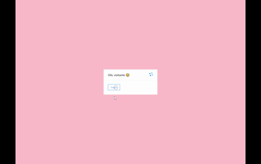

# :page_with_curl: Basic microservices Template

<p align="center">
  
</p>

#### This project uses 3 services in serverside
* mysql database server  - port 7200
* graphql api-gateway server - port 7000
* a headless Content delivery using Express - port 7100
#### and 1 clientside service.
* react app server

## This project uses
#### Frontend
React
Graphql
Antd
render mappings by lat and long using MapRequest

#### DevOps
* Docker (and Docker Compose) last safe version

#### Database and server
* Node.js ^12
* MySQL ^2.2.5
* Sequelize ^6.3.5

#### Backend
* An api gateway for database using Graphql
* Node.js

## Installation

### in main directory
```
docker-compose up
```
## migration

#### in command line:
this command will enter the container of customers service
```
docker exec -it $(docker ps | grep 7100 | awk '{print $1}')
```
then, run this command:
```
yarn db:migrate
```
### in a separate terminal, inside react app
- yarn
- yarn start

### Routes in backend

* /mock - mock database with 1000 entries
* /clear-database - clear database
* /customers - list customers if filtered with city
* /customer - get customer by id with "?id={id}"
* /customers/count/city - group and agreggate customers by city


